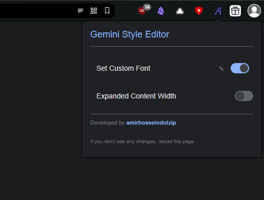

# Gemini Style Editor

**Version:** 2.3  
**Developer:** [amirhosseindotzip](https://github.com/amirhosseindotzip)

A simple Chrome extension I made for my personal use, because the default Persian font on Google Gemini chatbot was very unreadable. This extension enhances your experience on `gemini.google.com` by allowing you to apply the `Vazirmatn` font to the website for better readability. Users can also add a custom font and expand the width of the conversation area.

## Features

* **Custom Font Toggle:**
    * Easily enable or disable a custom font for the entire Gemini interface.
    * When enabled without a custom URL, it defaults to applying the **Vazirmatn** font.
    * It applies the font to all main text elements, including code blocks and specific language tags (`*:lang(fa)`).
* **Custom Google Font URL:**
    * Click the "edit" icon (✎) to add your own custom font URL from Google Fonts (e.g., `https://fonts.googleapis.com/css2?family=Roboto...`).
    * The extension automatically parses the URL to identify and apply the correct font family.
* **Expanded Content Width:**
    * Toggle an "Expanded Mode" to increase the width of the chat interface.
    * This changes the `max-width` of the conversation container and input area to `90%` of your viewport, making it much more readable on wider screens.
    * Chat bubbles and the user input box are also expanded to fill this new width.
* **Persistent Settings:**
    * Your preferences for both the font and expanded width are saved to `chrome.storage.sync` and applied automatically whenever you open Gemini.
* **Light/Dark Mode UI:**
    * The extension popup automatically adapts to your system's light or dark theme.

## How to Use

1.  Click the extension icon in your Chrome toolbar.
2.  Use the toggle switch for **"Set Custom Font"** to turn the font override on or off.
    * To use your own font, click the **edit icon (✎)** next to the toggle, paste your Google Fonts URL into the text box that appears, and press Enter.
3.  Use the toggle switch for **"Expanded Content Width"** to enable or disable the wider layout.
4.  Your changes will be applied to the active `gemini.google.com` tab immediately.

## Disclaimer

This extension is provided "as is" and "with all faults". The developer, amirhosseindotzip[cite: 58], makes no warranties, expressed or implied, and hereby disclaims and negates all other warranties including, without limitation, implied warranties or conditions of merchantability, fitness for a particular purpose, or non-infringement of intellectual property or other violation of rights.

In no event shall the developer be liable for any damages (including, without limitation, damages for loss of data or profit, or due to business interruption) arising out of the use or inability to use this extension, even if the developer has been notified orally or in writing of the possibility of such damage. The user assumes all responsibility and risk for the use of this software.

## Installation (from Source)

1.  Download or clone the project to your pc and unzip it into a folder.
2.  Open Google Chrome (or any other chrome based browser like vivaldi) and navigate to `chrome://extensions`.
3.  Enable **"Developer mode"** using the toggle in the top-right corner.
4.  Click the **"Load unpacked"** button.
5.  Select the `gemini-style-editor` directory you created in step 1.
6.  The extension will be installed and ready to use.